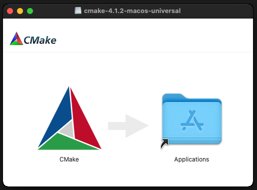
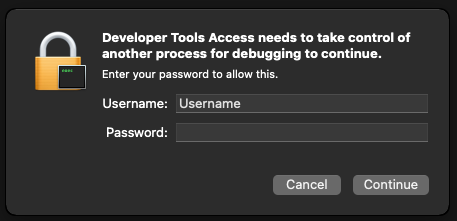

# VSCode CMake C++ project template

Why?  
Because my CLion license expired.  
And because I want to make C++ development make accessible for more people.  
Because C++ is awesome!*

This is an introductory project to the realm of cross-platform, desktop, open-source C++ development.

Tested on:

- Arch Linux with GCC 14.2.1 and 15.1.1
- Windows 11 with MSVC 19.43.34810

## The Path of Least Resistance - Simplified Guide

We're only going to build the Debug version of the project with the default toolchain, default compiler and default makefile generator for each platform, to make things as simple as possible.

### System Environment preparation - Installing the Toolchain

Click on the operating system you want to build the project on, to jump to the platform specific instructions for installing necessary tools.

- [Windows 11](#windows-11---tools-installation) - MSVC toolchain
- [Linux](#linux---tools-installation) - GCC toolchain
- [macOS](#macos---tools-installation) - Apple LLVM / Apple Clang toolchain

### Windows 11 - tools installation

Install following tools:

- [Visual Studio 2022 Community](https://visualstudio.microsoft.com/vs/community/) - provides
    - MSVC compiler, 
    - _Visual Studio 17 2022_ makefile generator for CMake,
    - CMake build system utilities and _Developer PowerShell for VS 2022_ (which isn't included in _Build Tools for Visual Studio_ unfortunately, therefore we're installing the entire Visual Studio IDE).
    
    Install Visual Studio 2022 Community IDE. Open _Visual Studio Installer_, where you choose following components for download and installation:
    
    **_Core Components:_**

    - MSVC Compiler Toolchain in latest version (at the time of writing it's v143) in both variants: with and without Spectre/Meltdown mitigations
    - Windows SDK (Windows 11 24H2 uses `Windows SDK version 10.0.22621.0 to target Windows 10.0.26100` as seen in the CMake generate output)
    - C++ Core Features (includes standard library implementations)
    - CMake tools for Windows

- [git](https://git-scm.com/downloads/win) - _git_ version control system
    - Install with default settings.

#### Adjusting the system

Verify that the `git` executable recognizable by the system without specifying the exact path to the `git.exe` executable: Open _Developer PowerShell for VS 2022_ and type there `git --version` . If you get a response similar to

```
git version 2.49.0.windows.1
```

everything is set up correctly, and we can proceed with building the project.

Otherwise it's needed put the binary directory in the system `Path` variable.

1. Open Windows Settings (e.g. Win+X -> Settings) -> System -> About -> Advanced system settings . A dialog window _System Properties_ opens.
1. In the _System Properties_ dialog window click on tab _Advanced_ -> click on _Environment Variables_ button. A dialog window _Environment Variables_ opens.
1. In the _Environment Variables_ dialog window In section _System variables_ find variable `Path` . Double click on it. A dialog window _Edit environment variable opens_.
1. In the _Edit environment variable opens_ dialog window click on _New_ button. A new line at the bottom in the list of paths is created. Assuming the git is installed to the default path `C:\Program Files\Git`, enter in the line the `cmd` directory in it, where the `git.exe` is located - `C:\Program Files\Git\cmd` [note the absence of the trailing backslash!] . Confirm all dialog windows by clicking on _OK_ button.
1. Open a new _Developer PowerShell for VS 2022_ window and test the `git --version` command again. Now the terminal will recognize the `git` as a valid command and outputs the currently installed git version as noted above.

Continue with [building the project](#windows-11---clone--build-instructions).

### Linux - tools installation

Install packages that contain these utilities which provide following functionality:

- `gcc`/`g++` - The Compiler
- `make` - _Unix Makefiles_ generator for CMake
- `cmake` - CMake metamakefiles generator
- `git` - _git_ version control system

All these packages might be contained in one metapackage `build-essentials` , that might be available for your Linux distribution. For brewity and simplicity of this tutorial, I'll leave that for you as a homework, how to install the toolchain. Here are the commands for most used Linux distributions:

- Arch Linux: `sudo pacman -Sy gcc make cmake git`
- Ubuntu: `sudo apt-get install TODO`
- Debian: `sudo apt-get install TODO`
- Fedora: `sudo dnf TODO`
- Oracle Linux: `sudo dnf TODO`
- OpenSuse: `sudo zypper TODO`

### macOS - tools installation

Install following tools

- [Developer tools: git, clang](https://apps.apple.com/us/app/xcode/id497799835?mt=12/) - provides Apple Clang compiler, _Xcode_ makefile generator and Xcode Command Line Tools
    - Xcode Command Line Tools Requires macOS debugging requires `LLDB.framework`, which can be obtained by installing:

        ```sh
        xcode-select --install
        #output: xcode-select: note: install requested for command line developer tools
        ```

        which opens a dialog window: press `Confirm` and `Agree` in the dialog pop-ups to begin installation. Be patient, it might take a while.

        After installation has finished, check version of installed utilities (to date 2025/11/02)

        ```sh
        git --version
        #output: git version 2.30.1 (Apple Git-130)
        
        clang --version
        #output:
        #Apple clang version 12.0.5 (clang-1205.0.22.11)
        #Target: x86_64-apple-darwin20.6.0
        #Thread model: posix
        #InstalledDir: /Library/Developer/CommandLineTools/usr/bin
        ```

- [CMake](https://cmake.org/download/#latest) or [direct link](https://github.com/Kitware/CMake/releases/latest) - download manually :look for `cmake-<VERSION>-macos-universal.dmg` provides CMake build system utilities.  
Or download automatically via script:

    ```sh
    cd vscode_cpp_cmake_example_project/
    ./install_CMake_on_macOS.sh
    ```

    _Note to other platforms:_  
    Windows 11 doesn't need this script by default as CMake is installed together as a component alongside Visual Studio. Linux and BSD distributions can install CMake via a package manager. Only macOS needs a script for handling CMake installation, as it isn't shipped with XCode build tools, and handling installation via `homebrew` would be overwhelming overkill for a newcomer to C++ development.

    A Finder window will open with mounted CMake installer image. Drag the CMake app to the Application directory shortcut.

    

    Then open a new tab in Terminal [`Option` + `T`] and verify that CMake utility is accessible.

    ```sh
    echo ${PATH}
    #output:/Applications/CMake.app/Contents/bin:/usr/local/bin:/usr/bin:/bin:/usr/sbin:/sbin

    cmake --version
    #output:
    #cmake version 4.1.2
    #
    #CMake suite maintained and supported by Kitware (kitware.com/cmake)
    ```

    After installation/copying of the CMake executable to the _Applications_ directory, you can close the Finder window and the automatically opened window upon mounting the CMake dmg file, and unmount the CMake dmg disk on Desktop

- `git` - will be installed with the `Xcode` command
    - when opening _Terminal_ and typing `git` and confirming by `Enter`, when neither Xcode, nor git is installed, it will output

        ```
        xcode-select: note: no developer tools were found at '/Applications/Xcode.app', requesting install. Choose an option in the dialog to download the command line developer tools.
        ```

### VSCode Extensions

**_VSCode extensions for Windows and macOS_**


**_VSCode extensions for Linux_** TODO update: CMake from twxs is no longer needed


- [`C/C++`](https://marketplace.visualstudio.com/items?itemName=ms-vscode.cpptools) from _Microsoft_
    - adds support for debugging and syntax completion
- [`CMake Tools`](https://marketplace.visualstudio.com/items?itemName=ms-vscode.cmake-tools) from _Microsoft_
    - adds support for CMake syntax completion & highlighting
    - installs `CMake` [twxs] extension alongside with the main extension, but since version ~1.21.13 it's no longer needed, thus can be disabled - for syntax completion and referencing
- **_[Linux only!]_** [`clangd`](https://marketplace.visualstudio.com/items?itemName=llvm-vs-code-extensions.vscode-clangd) from _LLVM_
    - adds support for syntax completion - `clangd` completion seems to me to be more reliable on Linux platform than default IntelliSense from Microsoft's `C/C++` extension. Tested on Arch Linux

### Build instructions - The Path of Least Resistance

We're only going to build the Debug version of the project with default compiler and makefile generator, to make things as simple as possible.

- Configuring with CMake
- Building the project
- Running the executable

Click on the operating system you want to build the project on, to jump to the platform specific instructions for building the project.

- [Windows 11](#windows-11---clone--build-instructions): MSVC toolchain
- [Linux](#linux---clone--build-instructions): GCC toolchain
- [macOS](#macos---clone--build-instructions): Apple LLVM / Apple Clang toolchain

#### Windows 11 - clone & build instructions

Open _Developer PowerShell for VS 2022_

##### Full build

You may copy&paste the commands line-by-line, or execute it all at once, in the _Developer PowerShell for VS 2022_

```powershell
cd "${HOME}"
mkdir git
cd git
git clone https://github.com/kyberdrb/vscode_cpp_cmake_example_project.git
cd vscode_cpp_cmake_example_project

# Error 'Cannot find path' is normal, when the directory doesn't exist. This command runs successfully when the directory will be present after building the project
Remove-Item -Recurse -Verbose -Path .vscode/
Remove-Item -Recurse -Verbose -Path build/

mkdir build/ # fails, if the directory already exists, which is also normal
cd build/

ls .. # look at the files we're going to work with
cmake .. # Specifying Debug version by 'cmake -DCMAKE_BUILD_TYPE=Debug ..' is ignored as VS2022 is a multi-config generator, that generates the desired executable variant in CMake build command, not in CMake generate command [which is what single-config generators are using]

ls # look at the files we're going to work with
cmake --build . --config Debug # Build the Debug version of the project's binary: the command 'cmake --build .' builds the Debug version by default, but by making the build type explicit, it also makes the understanding easier. For multi-config makefile generators like VS2022 - the default one in Windows 11 - is the build command a place for specifying executable variant, e.g. Debug, Release, etc.
./Debug/my_cpp_project.exe # Run the project
```

[Here](res/example_output-windows_11-simple.txt) is an example output from _Developer PowerShell for VS 2022_ on Windows 11 with Visual Studio 17.13.6 and Git 2.49.0 .

Example output from _Developer PowerShell for VS 2022_ on Windows 11 with Visual Studio 2022 Community 17.13.6 and Git 2.49.0 is available [here](res/example_output-simple_windows_11.txt).

##### Incremental build

After making changes to the project, we don't need to go through the entire procedure. This **_one-liner_** command in the _Developer PowerShell for VS 2022_ is sufficient for the changes to be built into the executable.

```powershell
# Build
cd "${HOME}\git\vscode_cpp_cmake_example_project\build\" ; cmake .. ; cmake --build . --config Debug; .\Debug\my_cpp_project.exe

# Rebuild i.e. clean & build
cd "${HOME}\git\vscode_cpp_cmake_example_project\" ; Remove-Item -Recurse -Verbose -Path .vscode/ ; Remove-Item -Recurse -Verbose -Path build/ ; mkdir build/ ; cd build/ ; cmake .. ; cmake --build . --config Debug; .\Debug\my_cpp_project.exe
```

#### Linux - clone & build instructions

Open _Terminal_

##### Full build

```sh
cd "${HOME}"
mkdir git
cd git
git clone https://github.com/kyberdrb/vscode_cpp_cmake_example_project.git
cd vscode_cpp_cmake_example_project

rm --recursive --verbose .vscode/
rm --recursive --verbose build-Debug/

mkdir build-Debug
cd build-Debug

ls ..
cmake -DCMAKE_BUILD_TYPE=Debug .. # a little more complex than 'cmake ..' but the option '-DCMAKE_BUILD_TYPE=Debug' adds debug information into the executable, making it debuggable with 'F5' found under 'Run & Debug' (Ctrl + Shift + D) on the side menu

ls
cmake --build .

./my_cpp_project
```

##### Incremental build

**_One-liners:_**

```sh
# Build
date && cd "${HOME}/git/vscode_cpp_cmake_example_project/build-Debug" && cmake -DCMAKE_BUILD_TYPE=Debug .. && cmake --build . && ./my_cpp_project

# Rebuild i.e. clean & build
date && cd "${HOME}/git/vscode_cpp_cmake_example_project/" && rm --recursive --verbose .vscode/ && rm --recursive --verbose build-Debug/ && mkdir build-Debug/ && cd "build-Debug/" && cmake -DCMAKE_BUILD_TYPE=Debug .. && cmake --build . && ./my_cpp_project
```

#### macOS - clone & build instructions

Open _Terminal_

```sh
cd "${HOME}"
mkdir git
cd git
git clone https://github.com/kyberdrb/vscode_cpp_cmake_example_project.git
cd vscode_cpp_cmake_example_project

rm -rv .vscode/
rm -rv build-Debug/

mkdir build-Debug
cd build-Debug

ls ..
cmake -DCMAKE_BUILD_TYPE=Debug .. # a little more complex than 'cmake ..' (which builds a Release version of the binary by default) but the option '-DCMAKE_BUILD_TYPE=Debug' adds debug information into the executable, making it debuggable with 'F5' found under 'Run & Debug' (Ctrl + Shift + D) on the side menu, so the program execution actually hangs on active breakpoints

ls
cmake --build .

./my_cpp_project

# Check whether the binary is debuggable, i. e. the Debug version of the binary had been configured
dsymutil my_cpp_project

# If you see this message:
#    warning: no debug symbols in executable (-arch x86_64)
# the binary was most likely been configured with the default, Release, version, most likely without specified build variant by
#   cmake ..
# Rerun the CMake configure command again with specified Debug variant as
#.   cmake -DCMAKE_BUILD_TYPE=Debug ..
# and build the binary afterwards
#.   cmake --build .
# and check for debugging symbols in the binary again
#.   dsymutil my_cpp_project
# expected output:
#.   <no output>

# Check binary for integrity
dwarfdump --verify my_cpp_project
#Verifying my_cpp_project:	file format Mach-O 64-bit x86-64
#Verifying .debug_abbrev...
#Verifying .debug_info Unit Header Chain...
#Verifying .debug_types Unit Header Chain...
#No errors.

# Check debug symbols: '-a': Display all symmbol table entries, including those inserted for use by debuggers.
echo "Total symbols: $(nm -a my_cpp_project | wc -l)"
echo "Debug symbols: $(nm -a my_cpp_project | grep ' - ' | wc -l)"
# Debug version
#    Total symbols:     2736
#    Debug symbols:     2115
# Release version
#    Total symbols:      621
#    Debug symbols:        0
```

##### Incremental build

**_One-liners:_**

```sh
# Build
date && cd "${HOME}/git/vscode_cpp_cmake_example_project/build-Debug" && cmake -DCMAKE_BUILD_TYPE=Debug .. && cmake --build . && ./my_cpp_project

# Rebuild i.e. clean & build
date && cd "${HOME}/git/vscode_cpp_cmake_example_project/" && rm -rv .vscode/ && rm -rv build-Debug/ && mkdir build-Debug/ && cd "build-Debug/" && cmake -DCMAKE_BUILD_TYPE=Debug .. && cmake --build . && ./my_cpp_project
```

### Making Changes

**Edit-Build-Run workflow**  
After making changes to the project, build it incrementally by using the command in the _Incremental build_ chapters.

Command for running the compiled executable normally - without debugging - is listed in the build instructions for specific platforms as the last command.

Debugging sessions can be configured and launched in _Run & Debug_ (`Ctrl + Shift + D`) extension pane on the left hand side. At the top of the pane, select the debugging session by your platform, i.e. operating system: these options are configured in `launch.json` . In the `main.cpp` click on the line numbers you want to stop the program's execution and introspect the variable values. Then start the debugging session by clicking on the green triangle or by pressing `F5` .

#### Note for macOS

When debugging executable for the first time after reboot, the system might prompt you to enter password of current user account to proceed.



After entering the password, the debugger might set up LLDB and Python, then it immediately attaches to the binary.

## VSCode Project configuration

- settings.json
- launch.json
- .clangd

## Build Instructions - The Path of Ninja - Advanced Guide

Are you ready for more? Check out advanced stuff on branch `advanced_skeleton` coming soon!

## Sources

See the [`sources` file](sources.md) .
