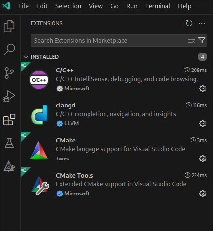

# VSCode CMake C++ project template

With clangd syntax completion & debugging support

Building with GCC compiler, GDB debugger

Linux (possibly UNIX) only

Tested on Arch Linux with GCC 14.2.1

## Extensions Installed

- `C/C++` [Microsoft]
    - adds support for debugging
- `CMake Tools` [Microsoft]
    - adds support for CMake syntax completion & highlighting
    - installs `CMake` [twxs] extension alongside with the main extension
- `clangd` [LLVM]
    - add support for syntax completion



## Build Commands

Commands in chronologic order

### Build

Set path to repo and executable name. Assuming we're already in the repo dir.

```sh
cd /path/to/repo
PATH_TO_REPO="$(pwd)"
EXECUTABLE_NAME="my_cpp_project"
DEBUG_BUILD_DIR_NAME="build-Debug"
RELEASE_BUILD_DIR_NAME="build-Release"
```

Verify

```sh
echo ${PATH_TO_REPO}
echo ${EXECUTABLE_NAME}
echo ${DEBUG_BUILD_DIR_NAME}
echo ${RELEASE_BUILD_DIR_NAME}
```

The absolute path to the repository directory will be printed.

### Debug

```sh
cd "${PATH_TO_REPO}"
rm --verbose --recursive "${DEBUG_BUILD_DIR_NAME}"
mkdir "${DEBUG_BUILD_DIR_NAME}"
cd "${DEBUG_BUILD_DIR_NAME}"
pwd
ls
ls ..
cmake -DCMAKE_BUILD_TYPE=Debug ..
cmake --build .
ls
ldd ${EXECUTABLE_NAME}
```

**Incremental Debug Build One-Liner**

```
date && cd "${PATH_TO_REPO}/${DEBUG_BUILD_DIR_NAME}" && cmake -DCMAKE_BUILD_TYPE=Debug .. && cmake --build . && ./${EXECUTABLE_NAME}
```

Set a breakpoint on an arbitrary nonempty line inside a function's body. Then run a debugger with `F5`. The debugger launches the executable, attaches to it, and the execution halts at the breakpoint.

### Release

```sh
cd "${PATH_TO_REPO}"
rm --verbose --recursive "${RELEASE_BUILD_DIR_NAME}"
mkdir "${RELEASE_BUILD_DIR_NAME}"
cd "${RELEASE_BUILD_DIR_NAME}"
pwd
ls
ls ..
cmake -DCMAKE_BUILD_TYPE=Release ..
cmake --build .
ls
```

**Incremental Release Build One-Liner**

```
date && cd "${PATH_TO_REPO}/${RELEASE_BUILD_DIR_NAME}" && cmake -DCMAKE_BUILD_TYPE=Release .. && cmake --build . && ./${EXECUTABLE_NAME}
```

## Notes

The autocompletion and `Ctrl + click`/`F12` reference resolution works after first configuration/generation of the project. The clangd picks up the generated `compile_commands.json` from the `build` directory and starts completing with `Ctrl + Space`.

## VCS

Check repo status

`date && git branch && git status && git diff`

## Project structure

```
my_cpp_project/
├── .vscode/
│   ├── settings.json    # For clangd configuration and IntelliSense
│   ├── launch.json      # For debugging configuration
├── src/                 # Directory for source files
│   └── main.cpp         # Main source file - the entry point
├── build-Debug/         # For configuring Clangd language server
│   └── my_cpp_project   # Built binary for Debug version
├── build-Release/       # For configuring Clangd language server
│   └── my_cpp_project   # Built binary for Release version
├── .clangd              # For configuring Clangd language server
├── .gitignore           # For ommitting generated/compiled files
├── CMakeLists.txt       # CMake build configuration
└── README.md            # Project description, build instructions
```

---

## What would an absolute minimal CMake C++ project look like in VSCode with clangd IntelliSense autocompletion and debugging support?

An absolute minimal C++ project setup with CMake, `clangd` for IntelliSense/autocompletion, and debugging support in VS Code would focus on the essential configurations. This setup provides just the bare minimum to get autocompletion, build, and debug capabilities without unnecessary complexity.

### Project Structure

```
my_cpp_project/
├── .vscode/
│   ├── settings.json    # For clangd configuration and IntelliSense
│   ├── launch.json      # For debugging configuration
├── src/
│   └── main.cpp         # Main source file
├── CMakeLists.txt       # CMake build configuration
└── README.md            # (optional)
```

### 1. **C++ Source File**

Start with a simple `main.cpp` that can be compiled and run.

**src/main.cpp**
```cpp
#include <iostream>

int main() {
    std::cout << "Hello, VS Code + CMake + clangd!" << std::endl;
    return 0;
}
```

### 2. **CMakeLists.txt**

This is the minimum required CMake configuration to build the project and generate the `compile_commands.json` file that `clangd` requires for autocompletion.

**CMakeLists.txt**
```cmake
cmake_minimum_required(VERSION 3.10)

# Project name and version
project(MyCppProject VERSION 1.0)

# Specify C++ standard
set(CMAKE_CXX_STANDARD 17)
set(CMAKE_CXX_STANDARD_REQUIRED True)

# Specify the source file to compile
add_executable(my_cpp_project src/main.cpp)

# Enable compile_commands.json generation for clangd
set(CMAKE_EXPORT_COMPILE_COMMANDS ON)
```

### 3. **VS Code Configuration Files**

#### 3.1 **settings.json** (for `clangd`)

This file ensures that VS Code uses `clangd` for autocompletion and associates the `compile_commands.json` file correctly.

**.vscode/settings.json**
```json
{
    "files.associations": {
        "CMakeLists.txt": "cmake"
    },
    "C_Cpp.intelliSenseEngine": "disabled",  // Disable MSVC IntelliSense in favor of clangd
    "clangd.arguments": [
        "--compile-commands-dir=build"       // Tell clangd to use compile_commands.json from build directory
    ]
}
```

#### 3.2 **launch.json** (for debugging)

To configure GDB debugging within VS Code, you need a `launch.json` file. This example assumes the program is built and outputs the binary in the `build/` directory.

**.vscode/launch.json**
```json
{
    "version": "0.2.0",
    "configurations": [
        {
            "name": "(gdb) Launch",
            "type": "cppdbg",
            "request": "launch",
            "program": "${workspaceFolder}/build/my_cpp_project",  // Location of the compiled executable
            "args": [],
            "stopAtEntry": false,
            "cwd": "${workspaceFolder}",
            "environment": [],
            "externalConsole": false,
            "MIMode": "gdb",
            "miDebuggerPath": "/usr/bin/gdb",                      // Path to GDB
            "setupCommands": [
                {
                    "description": "Enable pretty-printing for gdb",
                    "text": "-enable-pretty-printing",
                    "ignoreFailures": true
                }
            ]
        }
    ]
}
```

### 4. **Building the Project**

To build the project, you can use terminal commands directly:

1. Create the build directory:
   ```bash
   mkdir build && cd build
   ```

2. Run CMake to generate the necessary files, including `compile_commands.json`:
   ```bash
   cmake ..
   ```

3. Build the project:
   ```bash
   cmake --build .
   ```

After the project is built, `compile_commands.json` will be available in the `build/` directory, and `clangd` will use it for autocompletion.

### 5. **Debugging the Project**

Once the project is built, you can debug it using VS Code’s built-in debugger:

1. Click on the "Run and Debug" section in the VS Code sidebar.
2. Choose the "(gdb) Launch" configuration from `launch.json`.
3. Hit the green play button to start debugging.

### Summary of Steps

1. **IntelliSense (Code Completion) with clangd**:
    - Ensure that the `compile_commands.json` file is generated by CMake (`set(CMAKE_EXPORT_COMPILE_COMMANDS ON)` in `CMakeLists.txt`).
    - Configure VS Code to use `clangd` for autocompletion by setting up `.vscode/settings.json`.
  
2. **Build**:
    - Run CMake to configure the project and then build it.
  
3. **Debug**:
    - Configure `launch.json` for debugging with GDB, and start debugging using the VS Code interface.

This is the minimal setup for working with CMake, `clangd`, and debugging in VS Code for a C++ project. Once everything is working, you can further customize the build, debugging tasks, and settings as needed.

## Do I need to install any extensions?

Yes, to fully leverage Visual Studio Code as a C++ IDE with the setup you've described, you'll need to install some extensions for code completion, debugging, and CMake support. Here are the key extensions to install:

### 1. **CMake Tools**
   - **Name**: `CMake Tools`
   - **Publisher**: Microsoft
   - **Purpose**: This extension simplifies working with CMake projects by providing features like configuring, building, and debugging directly from the VS Code interface.
   - **Installation**: Search for "CMake Tools" in the Extensions tab of VS Code (`Ctrl+Shift+X`), or install it from the marketplace:
     ```
     ext install ms-vscode.cmake-tools
     ```

### 2. **C/C++ Extension (Optional, if using `clangd` for IntelliSense)**
   - **Name**: `C/C++`
   - **Publisher**: Microsoft
   - **Purpose**: Provides IntelliSense, code navigation, and debugging for C++ projects. While you're using `clangd` for code completion, this extension provides debugging support with `launch.json` configuration.
   - **Installation**: You can search for "C/C++" in the Extensions tab or install it with:
     ```
     ext install ms-vscode.cpptools
     ```

   **Note**: If you are relying on `clangd` for autocompletion, you can disable IntelliSense from this extension to avoid conflicts (`"C_Cpp.intelliSenseEngine": "disabled"` in `settings.json`).

### 3. **Clangd**
   - **Name**: `clangd`
   - **Publisher**: llvm-vs-code-extensions
   - **Purpose**: This extension provides powerful autocompletion, error checking, and code navigation for C++ projects. It relies on the `compile_commands.json` file generated by CMake for accurate information.
   - **Installation**: Install via the Extensions tab in VS Code, or run:
     ```
     ext install llvm-vs-code-extensions.vscode-clangd
     ```

### 4. **CMake Language Support (Optional)**
   - **Name**: `CMake`
   - **Publisher**: twxs
   - **Purpose**: Provides syntax highlighting and basic IntelliSense for CMake scripts (`CMakeLists.txt`).
   - **Installation**: You can install it from the Extensions tab, or run:
     ```
     ext install twxs.cmake
     ```

### 5. **CodeLLDB (Optional for Debugging)**
   - **Name**: `CodeLLDB`
   - **Publisher**: Vadim Chugunov
   - **Purpose**: If you prefer using `lldb` as your debugger (instead of GDB), this extension provides VS Code integration for LLDB.
   - **Installation**: You can install it via:
     ```
     ext install vadimcn.vscode-lldb
     ```

### Steps to Install Extensions:
1. Open the Extensions view (`Ctrl+Shift+X`).
2. Search for the names listed above.
3. Click **Install** next to the relevant extensions.

### Summary of Required Extensions
- **Essential**:
  - `CMake Tools`
  - `clangd`
  
- **Optional**:
  - `C/C++` (if you want VS Code’s debugger integration)
  - `CodeLLDB` (if you prefer LLDB over GDB)
  - `CMake` (for CMake syntax highlighting)

This setup ensures you have code completion (via `clangd`), easy CMake integration, and debugging support for GDB (or LLDB).

## Can you please elaborate in more detail about the debugging configuration? Which extensions would you install, what files would you edit, regarding previous response?

Yes, to fully leverage Visual Studio Code as a C++ IDE with the setup you've described, you'll need to install some extensions for code completion, debugging, and CMake support. Here are the key extensions to install:

### 1. **CMake Tools**
   - **Name**: `CMake Tools`
   - **Publisher**: Microsoft
   - **Purpose**: This extension simplifies working with CMake projects by providing features like configuring, building, and debugging directly from the VS Code interface.
   - **Installation**: Search for "CMake Tools" in the Extensions tab of VS Code (`Ctrl+Shift+X`), or install it from the marketplace:
     ```
     ext install ms-vscode.cmake-tools
     ```

### 2. **C/C++ Extension (Optional, if using `clangd` for IntelliSense)**
   - **Name**: `C/C++`
   - **Publisher**: Microsoft
   - **Purpose**: Provides IntelliSense, code navigation, and debugging for C++ projects. While you're using `clangd` for code completion, this extension provides debugging support with `launch.json` configuration.
   - **Installation**: You can search for "C/C++" in the Extensions tab or install it with:
     ```
     ext install ms-vscode.cpptools
     ```

   **Note**: If you are relying on `clangd` for autocompletion, you can disable IntelliSense from this extension to avoid conflicts (`"C_Cpp.intelliSenseEngine": "disabled"` in `settings.json`).

### 3. **Clangd**
   - **Name**: `clangd`
   - **Publisher**: llvm-vs-code-extensions
   - **Purpose**: This extension provides powerful autocompletion, error checking, and code navigation for C++ projects. It relies on the `compile_commands.json` file generated by CMake for accurate information.
   - **Installation**: Install via the Extensions tab in VS Code, or run:
     ```
     ext install llvm-vs-code-extensions.vscode-clangd
     ```

### 4. **CMake Language Support (Optional)**
   - **Name**: `CMake`
   - **Publisher**: twxs
   - **Purpose**: Provides syntax highlighting and basic IntelliSense for CMake scripts (`CMakeLists.txt`).
   - **Installation**: You can install it from the Extensions tab, or run:
     ```
     ext install twxs.cmake
     ```

### 5. **CodeLLDB (Optional for Debugging)**
   - **Name**: `CodeLLDB`
   - **Publisher**: Vadim Chugunov
   - **Purpose**: If you prefer using `lldb` as your debugger (instead of GDB), this extension provides VS Code integration for LLDB.
   - **Installation**: You can install it via:
     ```
     ext install vadimcn.vscode-lldb
     ```

### Steps to Install Extensions:
1. Open the Extensions view (`Ctrl+Shift+X`).
2. Search for the names listed above.
3. Click **Install** next to the relevant extensions.

### Summary of Required Extensions
- **Essential**:
  - `CMake Tools`
  - `clangd`
  
- **Optional**:
  - `C/C++` (if you want VS Code’s debugger integration)
  - `CodeLLDB` (if you prefer LLDB over GDB)
  - `CMake` (for CMake syntax highlighting)

This setup ensures you have code completion (via `clangd`), easy CMake integration, and debugging support for GDB (or LLDB).

## When I open Run and Debug (Ctrl + Shift + D) side menu and click on Start Debugging (F5) I receive a prompt Configured debug type 'cppdbg' is not supported.

The error message `"Configured debug type 'cppdbg' is not supported"` usually happens when the **C/C++ extension by Microsoft** is not installed or not recognized correctly, as this extension provides the `cppdbg` debug type for GDB and LLDB debugging.

Here’s a step-by-step guide to resolve this issue:

### 1. **Verify the Installation of the `C/C++` Extension**
   - Make sure that you have the `C/C++` extension by Microsoft installed:
     - Go to the **Extensions** view (`Ctrl+Shift+X`).
     - Search for **C/C++** (by Microsoft).
     - If it’s not installed, install it by clicking **Install**.
     - If it’s already installed, try uninstalling and reinstalling it to ensure that it works correctly.

     You can also install it manually via the command:
     ```bash
     ext install ms-vscode.cpptools
     ```

### 2. **Disable Conflicting IntelliSense (Optional)**
   - If you are using `clangd` for autocompletion, it might conflict with the IntelliSense engine provided by the `C/C++` extension.
   - To resolve this, you can disable the IntelliSense feature of the `C/C++` extension without affecting its debugging capabilities:
     - Open **Settings** (`Ctrl+,`).
     - Search for `C_Cpp.intelliSenseEngine`.
     - Set `"C_Cpp.intelliSenseEngine": "disabled"` in your `settings.json`.

### 3. **Check the `launch.json` Configuration**
   - Ensure that your `.vscode/launch.json` file is correctly set up for `cppdbg`. Here's an example `launch.json` for GDB debugging:

     ```json
     {
       "version": "0.2.0",
       "configurations": [
         {
           "name": "(gdb) Launch",
           "type": "cppdbg",         // This requires the C/C++ extension
           "request": "launch",
           "program": "${workspaceFolder}/build/my_cpp_project",  // Path to the executable
           "args": [],
           "stopAtEntry": false,
           "cwd": "${workspaceFolder}",
           "environment": [],
           "externalConsole": false,  // Change to true if you prefer an external terminal
           "MIMode": "gdb",          // For GDB debugging
           "miDebuggerPath": "/usr/bin/gdb",  // Ensure this path is correct for GDB
           "setupCommands": [
             {
               "description": "Enable pretty-printing for gdb",
               "text": "-enable-pretty-printing",
               "ignoreFailures": true
             }
           ]
         }
       ]
     }
     ```

### 4. **Reload VS Code**
   - After installing the `C/C++` extension, restart VS Code to ensure all settings are loaded properly.
     - You can use the **Command Palette** (`Ctrl+Shift+P`) and type `Reload Window`.

### 5. **Install `CodeLLDB` for LLDB (if Needed)**
   - If you prefer using `LLDB` instead of `GDB`, ensure that the **CodeLLDB** extension is installed:
     ```bash
     ext install vadimcn.vscode-lldb
     ```
   - Update the `launch.json` file to use `lldb` instead of `gdb`:
     ```json
     "MIMode": "lldb",
     "miDebuggerPath": "/usr/bin/lldb"  // Adjust the path to LLDB if necessary
     ```

### 6. **Alternative: CMake Tools Debugging**
   - If you're using **CMake Tools**, you can also let it manage your debugging configuration automatically. 
   - Run the following commands from the Command Palette (`Ctrl+Shift+P`):
     - **CMake: Configure**: Sets up the project.
     - **CMake: Build**: Builds the project.
     - **CMake: Debug**: This will automatically start the debugger with appropriate settings.

### Final Check
1. After ensuring the `C/C++` extension is installed and your `launch.json` is configured, go back to the **Run and Debug** view (`Ctrl+Shift+D`).
2. Select the configuration (e.g., `(gdb) Launch`) and press **F5** or click **Start Debugging**.

This should resolve the `"cppdbg not supported"` issue and allow you to run the debugger for your C++ project in Visual Studio Code.

## I installed the ms-vscode.cpptools extension. I set the breakpoint before he return statement in main.cpp. But when I run the executable, it executed completely and hadn't stopped at the breakpoint. What do I need to do to make the debugger stop at the breakpoint?

If the debugger is not stopping at the breakpoint, there are a few common causes and potential solutions to get it working:

### 1. **Ensure the Program is Built with Debug Information**
   - In order for the debugger to stop at breakpoints, the program must be compiled with debug symbols enabled. When using CMake, make sure you are building your project in **Debug** mode.
   - Update your `CMakeLists.txt` to include debug information:

     ```cmake
     set(CMAKE_BUILD_TYPE Debug)  # This ensures the Debug build type
     ```

     - Alternatively, you can configure CMake from the terminal or in VSCode with a Debug flag:
       ```bash
       cmake -DCMAKE_BUILD_TYPE=Debug ..
       ```
   - This tells the compiler to include debugging information in the compiled binary. Specifically, it will add the `-g` flag for GCC/Clang, which is essential for debugging.

### 2. **Check the Build Output**
   - Ensure that your executable is built with the correct flags by inspecting the compiler output. You should see the `-g` flag in the compile commands.
   - If you are using **CMake Tools** in VSCode, make sure the active build type is **Debug**:
     - Go to the **Command Palette** (`Ctrl+Shift+P`) and select **CMake: Set Build Type**.
     - Choose **Debug**.
     - Then run **CMake: Build** to build the project with debug symbols.

### 3. **Ensure Breakpoint is Valid**
   - Ensure the breakpoint is set on a valid line of code that will be executed. For example, breakpoints cannot be set on blank lines, comments, or lines that don't generate machine instructions.
   - Move the breakpoint to a line that contains actual code execution.

### 4. **Use the Correct Program Path in `launch.json`**
   - Ensure that your `launch.json` configuration is pointing to the correct executable file.
   - If your executable is being generated in a different folder (like `build`), make sure the path is correct:
     ```json
     "program": "${workspaceFolder}/build/my_cpp_project",  // Ensure this points to the actual executable
     ```

### 5. **Rebuild the Project**
   - After making any changes to `CMakeLists.txt` or build type, it’s a good idea to clean and rebuild the project to ensure that all files are compiled with debug symbols:
     ```bash
     cmake --build . --clean-first
     ```

### 6. **Check the `launch.json` Configuration**
   - Double-check that your `launch.json` file is properly set up to handle debugging with `cppdbg`. Here’s an example of a typical setup:
     ```json
     {
       "version": "0.2.0",
       "configurations": [
         {
           "name": "(gdb) Launch",
           "type": "cppdbg",
           "request": "launch",
           "program": "${workspaceFolder}/build/my_cpp_project",  // Path to the built executable
           "args": [],
           "stopAtEntry": false,
           "cwd": "${workspaceFolder}",
           "environment": [],
           "externalConsole": false,   // true if you want an external console
           "MIMode": "gdb",            // Use gdb for debugging
           "miDebuggerPath": "/usr/bin/gdb",  // Make sure gdb is correctly installed
           "setupCommands": [
             {
               "description": "Enable pretty-printing for gdb",
               "text": "-enable-pretty-printing",
               "ignoreFailures": true
             }
           ],
           "preLaunchTask": "build",   // Optional: ensure build before debugging
           "postDebugTask": "clean"    // Optional: clean after debugging
         }
       ]
     }
     ```

### 7. **Prelaunch Build (Optional)**
   - If you want to make sure that the project is always built before debugging, you can add a `preLaunchTask` in the `launch.json`:
     ```json
     "preLaunchTask": "build"
     ```
   - Then, in the `.vscode/tasks.json` file, configure a build task like this:
     ```json
     {
       "version": "2.0.0",
       "tasks": [
         {
           "label": "build",
           "type": "shell",
           "command": "cmake --build .",  // or your preferred build command
           "group": {
             "kind": "build",
             "isDefault": true
           }
         }
       ]
     }
     ```

### 8. **Check for Optimizations**
   - If your code was built with optimizations (e.g., `-O2` or `-O3`), the compiler might have optimized away certain code, making it difficult for the debugger to stop at the desired breakpoints.
   - Make sure optimizations are disabled in Debug mode:
     ```cmake
     set(CMAKE_CXX_FLAGS_DEBUG "-O0 -g")  // Disable optimizations in Debug mode
     ```

### 9. **Reload the Debugger**
   - If you’re still having trouble, try restarting Visual Studio Code or reloading the debugger window (`Ctrl+Shift+P` and then select **Reload Window**).

Once you’ve ensured that the project is built with the necessary debug symbols and the `launch.json` is properly configured, the debugger should stop at the breakpoints as expected.

## I rerun the CMake to instruct the compiler to include debug information to the binary with cmake -DCMAKE_BUILD_TYPE=Debug .. from within the build directory, as you suggested. Then I run the debugger with F5 and the debugger stopped at the breakpoint :)

Great to hear that the debugger stopped at the breakpoint! 🎉 It sounds like adding the debug symbols with `cmake -DCMAKE_BUILD_TYPE=Debug` did the trick. Now that your setup is working, you should be able to:

- Set additional breakpoints and step through your code.
- Inspect variables and memory.
- Continue building and debugging your project in VSCode efficiently.

If you encounter any more issues or need further customization (e.g., using `Valgrind`, `perf`, or any other tools), feel free to ask! Happy coding! 😊

## Workflow utilities/commands/scripts

Some of the commands had been extracted from CLion IDE

### CMake: clean target's build dir

Debug

`cmake --build ./cmake-build-debug/ --target clean`  
or wipe build dir  
`rm -rf ./cmake-build-debug/`

Release

`cmake --build ./cmake-build-release/ --target clean`  
or wipe build dir  
`rm -rf ./cmake-build-release/`

### CMake: generate Ninja makefiles

```
PATH_TO_PROJECT="/path/to/project"
```

Debug

`/usr/bin/cmake -DCMAKE_BUILD_TYPE=Debug -DCMAKE_MAKE_PROGRAM=/usr/bin/ninja -DCMAKE_C_COMPILER=/usr/bin/gcc -DCMAKE_CXX_COMPILER=/usr/bin/g++ -G Ninja -S ${PATH_TO_PROJECT} -B ${PATH_TO_PROJECT}/cmake-build-debug`

Release

`/usr/bin/cmake -DCMAKE_BUILD_TYPE=Release -DCMAKE_MAKE_PROGRAM=/usr/bin/ninja -DCMAKE_C_COMPILER=/usr/bin/gcc -DCMAKE_CXX_COMPILER=/usr/bin/g++ -G Ninja -S ${PATH_TO_PROJECT} -B ${PATH_TO_PROJECT}/cmake-build-release`

### CMake: Build

Debug

`/usr/bin/cmake --build ${PATH_TO_PROJECT}/cmake-build-debug --target Observer-Push-Concrete_Subject_and_Observers-Single_file -j $(nproc)`

Release

`/usr/bin/cmake --build ${PATH_TO_PROJECT}/cmake-build-release --target Observer-Push-Concrete_Subject_and_Observers-Single_file -j $(nproc)`

### Run

Debug

`${PATH_TO_PROJECT}/cmake-build-debug/Observer-Push-Concrete_Subject_and_Observers-Single_file`

Release

`${PATH_TO_PROJECT}/cmake-build-release/Observer-Push-Concrete_Subject_and_Observers-Single_file`

### Debug

Debug

Set a breakpoint and then press `F5`. Inspect variables, set more breakpoints and adjust code as needed.

`gdb`

### Valgrind - memory sanitizer

Debug

`${PATH_TO_PROJECT}/cmake-build-debug/Observer-Push-Concrete_Subject_and_Observers-Single_file`

### Perf - memory profiling

Change kernel variable to enable Perf to collect information about the program's runtime characteristics as a user with `sudo` (without `root` account access)

`sudo sh -c 'echo 1 > /proc/sys/kernel/perf_event_paranoid'`

Debug

`/usr/bin/perf record --freq=997 --call-graph dwarf -q -o /tmp/clion15732317547050053395perf ${PATH_TO_PROJECT}/cmake-build-debug/Observer-Push-Concrete_Subject_and_Observers-Single_file`

## Scanning for kits

After opening a directory with a CMake project in VSCode, the CMake VSCode extension prompts you to select kit.  
Choose one from the drop down menu from the command bar.

Configuration for all locally available kits will be stored in  
`/home/laptop/.local/share/CMakeTools/cmake-tools-kits.json`

Example CMake output after toolchain kit configuration:

```
[proc] Executing command: /usr/bin/cmake --version
[proc] Executing command: /usr/bin/cmake -E capabilities
[kit] Successfully loaded 3 kits from /home/laptop/.local/share/CMakeTools/cmake-tools-kits.json
[variant] Loaded new set of variants
[proc] Executing command: /usr/bin/gcc -v
[main] Configuring project: roboauto_assignment 
[proc] Executing command: /usr/bin/cmake -DCMAKE_BUILD_TYPE:STRING=Debug -DCMAKE_EXPORT_COMPILE_COMMANDS:BOOL=TRUE -DCMAKE_C_COMPILER:FILEPATH=/usr/bin/gcc -DCMAKE_CXX_COMPILER:FILEPATH=/usr/bin/g++ --no-warn-unused-cli -S/home/laptop/git/kyberdrb/vscode_cpp_cmake_minimal_project -B/home/laptop/git/kyberdrb/vscode_cpp_cmake_minimal_project/build -G Ninja
[cmake] Not searching for unused variables given on the command line.
[cmake] -- The C compiler identification is GNU 14.2.1
[cmake] -- The CXX compiler identification is GNU 14.2.1
[cmake] -- Detecting C compiler ABI info
[cmake] -- Detecting C compiler ABI info - done
[cmake] -- Check for working C compiler: /usr/bin/gcc - skipped
[cmake] -- Detecting C compile features
[cmake] -- Detecting C compile features - done
[cmake] -- Detecting CXX compiler ABI info
[cmake] -- Detecting CXX compiler ABI info - done
[cmake] -- Check for working CXX compiler: /usr/bin/g++ - skipped
[cmake] -- Detecting CXX compile features
[cmake] -- Detecting CXX compile features - done
[cmake] -- Configuring done (1.2s)
[cmake] -- Generating done (0.0s)
[cmake] -- Build files have been written to: /home/laptop/git/kyberdrb/vscode_cpp_cmake_minimal_project/build
[main] Configuring project: roboauto_assignment 
[proc] Executing command: /usr/bin/cmake -DCMAKE_BUILD_TYPE:STRING=Debug -DCMAKE_EXPORT_COMPILE_COMMANDS:BOOL=TRUE -DCMAKE_C_COMPILER:FILEPATH=/usr/bin/gcc -DCMAKE_CXX_COMPILER:FILEPATH=/usr/bin/g++ --no-warn-unused-cli -S/home/laptop/git/kyberdrb/vscode_cpp_cmake_minimal_project -B/home/laptop/git/kyberdrb/vscode_cpp_cmake_minimal_project/build -G Ninja
[cmake] Not searching for unused variables given on the command line.
[cmake] -- Configuring done (0.1s)
[cmake] -- Generating done (0.0s)
[cmake] -- Build files have been written to: /home/laptop/git/kyberdrb/vscode_cpp_cmake_minimal_project/build
```

Example content of `/home/laptop/.local/share/CMakeTools/cmake-tools-kits.json`

```
$ cat /home/laptop/.local/share/CMakeTools/cmake-tools-kits.json
[
  {
    "name": "Clang 18.1.8 x86_64-pc-linux-gnu",
    "compilers": {
      "C": "/usr/bin/clang",
      "CXX": "/usr/bin/clang++"
    },
    "isTrusted": true
  },
  {
    "name": "Clang-cl 18.1.8 x86_64-pc-windows-msvc",
    "compilers": {
      "C": "/usr/bin/clang-cl",
      "CXX": "/usr/bin/clang-cl"
    },
    "isTrusted": true
  },
  {
    "name": "GCC 14.2.1 x86_64-pc-linux-gnu",
    "compilers": {
      "C": "/usr/bin/gcc",
      "CXX": "/usr/bin/g++"
    },
    "isTrusted": true
  }
]
```

## Sources

- copied & pasted Q&A from OpenAI ChatGPT conversation `VS Code C++ Setup Arch`
- https://duckduckgo.com/?t=ffab&q=vscode+cppdbg&ia=web
- https://code.visualstudio.com/docs/cpp/launch-json-reference
- https://duckduckgo.com/?t=ffab&q=vscode+c%2B%2B+cmake+debugging&ia=web
- https://devblogs.microsoft.com/cppblog/introducing-cmake-debugger-in-vs-code-debug-your-cmake-scripts-using-open-source-cmake-debugger/
- https://www.reddit.com/r/neovim/comments/17rhvtl/guide_how_to_use_clangd_cc_lsp_in_any_project/
- https://clangd.llvm.org/installation.html
- https://www.reddit.com/r/cpp/comments/gy08ip/which_ide_do_you_use_or_if_you_prefer_text/
- https://duckduckgo.com/?q=clangd+vscode+c%2B%2B+cmake&t=ffab&ia=web
- https://duckduckgo.com/?q=clangd+vscode+c%2B%2B+cmake&t=ffab&ia=web
- https://stackoverflow.com/questions/51885784/how-to-setup-vs-code-for-c-with-clangd-support
- https://github.com/Mizux/cmake-cpp
- https://duckduckgo.com/?t=ffab&q=c%2Fc%2B%2B+extension+visual+studio+code+microsoft&ia=web
- https://code.visualstudio.com/docs/languages/cpp
- https://github.com/microsoft/vscode-cpptools
- https://duckduckgo.com/?q=microsoft+c%2Fc%2B%2B+extension+not+available+vscode&t=ffab&df=m&ia=web
- https://github.com/microsoft/vscode-cpptools/discussions/12840
- https://code.visualstudio.com/docs/cpp/config-linux#_prerequisites
- https://marketplace.visualstudio.com/items?itemName=ms-vscode.cpptools
- https://www.youtube.com/results?search_query=visual+studio+code+c%2B%2B+linux
- https://www.youtube.com/watch?v=oQ9E_LFoo9U
- https://github.com/marmottetranquille/Cpp-skeleton
- https://duckduckgo.com/?t=ffab&q=vscode+cmake+c%2B%2B+skeleton&ia=web
- 

- CMake Debugger
    - https://duckduckgo.com/?t=ffab&q=vscode+c%2B%2B+cmake+debugging&ia=web
    - https://devblogs.microsoft.com/cppblog/introducing-cmake-debugger-in-vs-code-debug-your-cmake-scripts-using-open-source-cmake-debugger/
